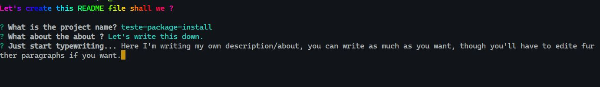
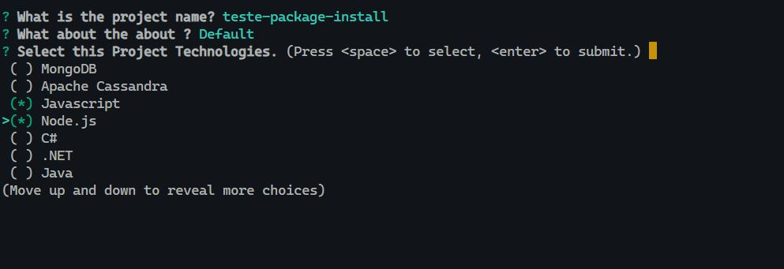
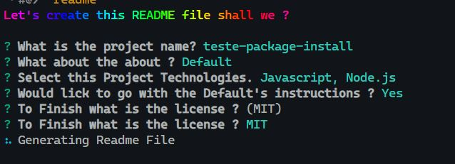

<h1 align="center">cli-readme-file-creator</h1>

<div> 
    <p align="center">
        <a href="#about">About</a> •
        <a href="#techs">Technologies & Tools</a> •
        <a href="#instructions">Instructions</a> •
        <a href="#license">License</a>
    </p>
</div>


---

<h2 id="about">About</h2>

This project aims to make your documentation's write faster, at an "developer's hands distance", it can use an readme's template to generate yours for every new project by just input the fields, then it will be further changed with your inputs.

At the current stage, 23/05/2022, you only has one template at your disposal, but with the soon-to-be expansion of the reserved keywords you can create how many templates you wish.

That is a possibility of change some interactivity at some steps during updates.
At this moment I'm not aiming for full fledge cli program, but I think if I keep have ideas and others too it might grow to it.

This README.md was firstly generated with this.
<h2 id="techs">Technologies & Tools</h2>

| Technologies |
|:---:|
| Javascript |
| Node.js |


<h2 id="instructions">Installation's Instruction</h2>

***__At this moment, this program will only work when run at an interactive shell__***

At this moment, it's advised to install at the global modules, this way you can run the aliases at every project folder, regardless of the
dependencies being installed at your currently project.

1. <h3>  Install globally</h3>

```shell
npm i @yuricss/cli-readme-file-creator -g
```

2. <h3>Run</h3>

```shell
readme
```

<br>


But, even so you feel like this wouldn't be worth and just want to try it follow bellow.

1. 2. <h3>Install as dev dependency</h3>

```shell
npm i @yuricss/cli-readme-file-creator --save-dev
``` 

2. 2. <h3>Run</h3>

```shell
npx @yuricss/cli-readme-file-creator
``` 

--- 
3. <h3>Instructions regarding the program</h3>

<br/>

1. When the question shows up answer it with the instructions showed in windows

2. You can rather pick the an Lorem Ipsum of ~130 letters or Writing you own Description.


3. During the step of selecting the technologies you can search by writing the name of it, there is 32 languages, frameworks and tools at this moment.


4. At least the license, at this moment, there is only MIT available, it will pick the project's name and author in package.json.



<h2 id="license">License</h2>

[MIT](LICENSE.txt) License

Copyright (c) 2022 Yuri Cruz Soares da Silva
